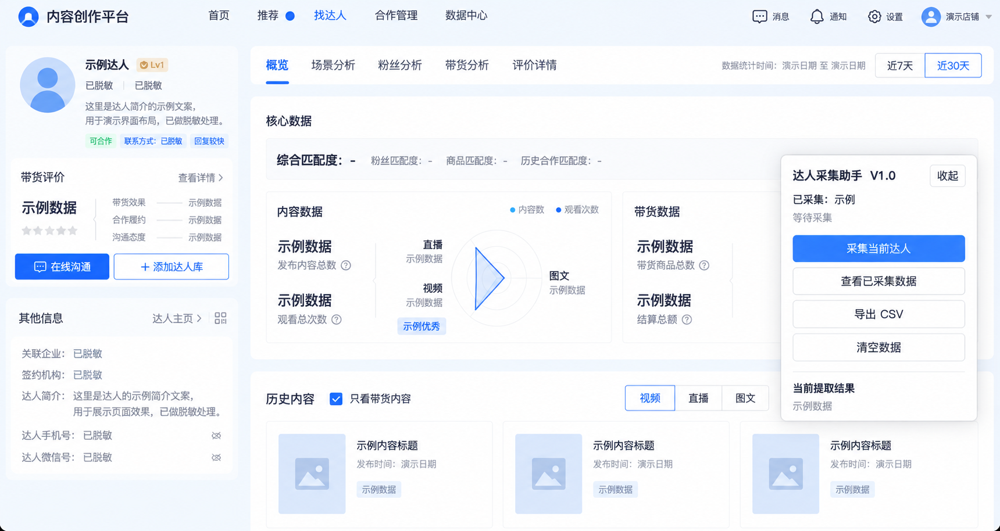
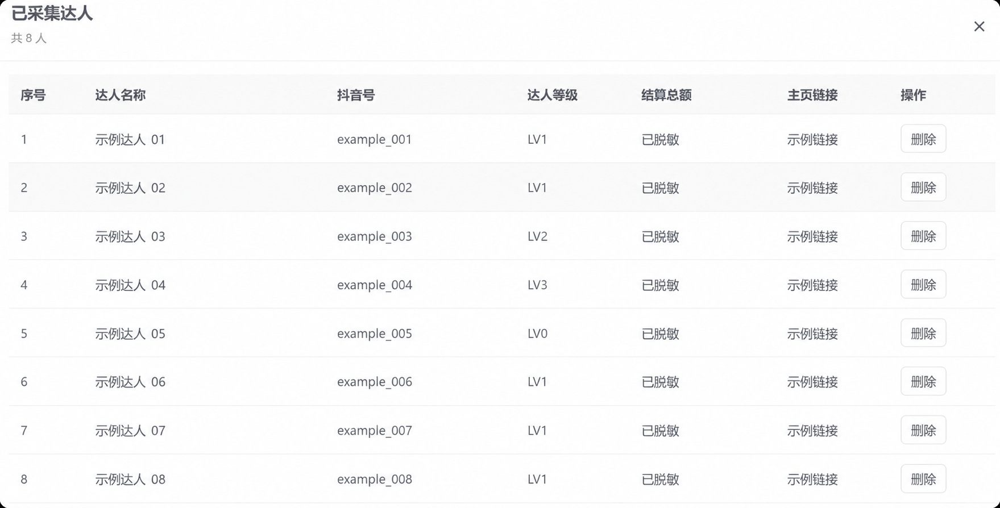

# Douyin Creator Collector / 抖店达人采集助手

A lightweight Tampermonkey userscript for collecting and managing creator details on the Douyin e-commerce creator marketplace.

一个轻量的 Tampermonkey 用户脚本，用于在抖音电商达人广场中采集和管理达人资料。

`JavaScript` · `Tampermonkey` · `Browser automation` · `DOM parsing` · `CSV export`

> An independent, unofficial project. Not affiliated with Douyin, Jinritemai, or their operators. Use it only for information you are authorized to access and process, in accordance with applicable site terms.
>
> 本项目为独立的非官方项目，与抖音、巨量百应或其运营方不存在关联。请仅处理你有权访问和使用的信息，并遵守适用的网站规则。

## What it does / 功能

- Displays a draggable panel on the **creator square** and **creator profile** pages; it does not display on unrelated site pages. Expand/collapse and panel positions are preserved locally.
- 在**达人广场**和**达人详情**页显示可拖动面板；不在无关页面显示。面板的展开/收起状态和位置仅保存在本地。

- On an opened creator profile, captures **creator name, Douyin ID, creator level, settlement total, and profile-page URL**.
- 在已打开的达人详情页采集**达人名称、抖音号、达人等级、结算总额和详情页链接**。

- Supports settlement ranges (for example, `2,500-5,000`) and shows `未授权` when the page says `达人未授权`. Currency symbols are removed from recorded amounts.
- 支持结算区间（例如 `2,500-5,000`）；页面显示“达人未授权”时会记录为 `未授权`。保存的金额会移除货币符号。

- Saves records in your browser, updates an existing record when its Douyin ID is collected again, and lets you view/delete records or export a batch CSV.
- 将记录保存在浏览器中；再次采集相同抖音号时会更新原有记录，并支持查看、删除及批量导出 CSV。

- Displays **打开主页** instead of a long URL in the panel; CSV retains the complete profile URL.
- 面板中以**打开主页**代替冗长链接；导出的 CSV 会保留完整的详情页链接。

> **Manual step:** If the site's QR tooltip cannot be opened by simulated hover, move your pointer over the QR icon on the profile page. The script waits for the Douyin ID to appear before continuing. It does not perform unattended bulk crawling.
>
> **手动步骤：** 若网站二维码提示无法通过模拟悬停打开，请将鼠标移至详情页的二维码图标。脚本会等待抖音号出现后继续；它不会进行无人值守的批量爬取。

## Installation / 安装

1. Install a userscript manager such as [Tampermonkey](https://www.tampermonkey.net/) in your browser.

   在浏览器中安装 [Tampermonkey](https://www.tampermonkey.net/) 等用户脚本管理器。

2. Open [`douyin-creator-collector.user.js`](./douyin-creator-collector.user.js), copy its **entire contents** into a new userscript in Tampermonkey, then save and enable it. Alternatively, install the raw `.user.js` file using your userscript manager if supported.

   打开 [`douyin-creator-collector.user.js`](./douyin-creator-collector.user.js)，将**完整内容**复制到 Tampermonkey 的新建脚本中，然后保存并启用。若脚本管理器支持，也可直接安装原始 `.user.js` 文件。

3. Sign in to an account that can access the relevant pages on `buyin.jinritemai.com`.

   登录有权访问 `buyin.jinritemai.com` 相关页面的账号。

4. Open the creator marketplace at `https://buyin.jinritemai.com/dashboard/servicehall/daren-square`; open a creator profile and click **采集当前达人**.

   打开达人广场 `https://buyin.jinritemai.com/dashboard/servicehall/daren-square`，进入某位达人详情后点击**采集当前达人**。

5. If prompted, hover over the profile QR icon. Use **查看已采集数据** to review or delete records, and **导出 CSV** to export a single batch file.

   如有提示，请悬停在详情页二维码图标上。使用**查看已采集数据**查看或删除记录，使用**导出 CSV**导出单个批次文件。

The floating panel is initially expanded on the two supported page types. Drag its title bar to reposition it or click **收起** to collapse it into a draggable button. On the marketplace listing page you can review or export data; collection itself requires opening a creator profile.

在两类支持页面中，浮动面板默认展开。拖动标题栏可调整位置，点击**收起**可将其折叠为可拖动按钮。在达人广场列表页可查看或导出数据；采集本身需要先进入达人详情页。

## Supported pages / 支持的页面

The userscript is enabled on `buyin.jinritemai.com`, but the panel is **shown only** for these pathnames:

用户脚本会在 `buyin.jinritemai.com` 上启用，但面板**仅会在**下列路径显示：

| Page / 页面 | Path / 路径 |
| --- | --- |
| Creator marketplace / 达人广场 | `/dashboard/servicehall/daren-square` |
| Creator detail / 达人详情 | `/dashboard/servicehall/daren-profile` |

The `uid` and other ordinary query parameters vary per creator and **are not hard-coded**. The site is a single-page application; the script checks page-path changes to show or hide the panel.

`uid` 等常规查询参数会随达人而变化，**不会被硬编码**。该网站是单页应用，脚本会检测页面路径变化以显示或隐藏面板。

## Data & privacy / 数据与隐私

Records live in your browser's **`localStorage` for `buyin.jinritemai.com`**. They are not synced across devices or browsers. This script does not implement a remote upload service; clicking CSV export creates a local download. The page URL in each record may include creator identifiers and tracking parameters.

记录保存在浏览器中 **`buyin.jinritemai.com` 对应的 `localStorage`**。它们不会在设备或浏览器之间同步。本脚本未实现远程上传服务；点击导出 CSV 只会创建本地下载。每条记录中的页面链接可能包含达人标识符和跟踪参数。

- **Back up regularly:** export CSV before clearing site data, changing browsers, or reinstalling. Deleting browser site data can remove saved records.
- **定期备份：** 清除站点数据、更换浏览器或重装前请导出 CSV。删除浏览器站点数据可能会移除已保存记录。

- **Do not commit** exported CSV files, creator IDs, real profile URLs, screenshots containing user/account details, or any logged-in page data to a public repository.
- 请勿将导出的 CSV、达人 ID、真实详情页链接、含账号信息的截图或任何已登录页面数据提交到公开仓库。

- Browser storage has a limited quota. There is no promised maximum number of records.
- 浏览器存储空间有限，项目不承诺可保存记录的最大数量。

- This project uses selectors from one observed site layout. Site UI changes, account permissions, or unavailable profile details may affect results. Verify the captured fields before using them.
- 本项目使用基于一个已观察网站布局的选择器。网站界面变动、账号权限或详情页字段不可用均可能影响结果；请在使用前核对采集字段。

## Project layout / 项目结构

```text
douyin-creator-collector/
├── douyin-creator-collector.user.js   # Installable userscript / 可安装用户脚本
├── tests/script.test.cjs              # Offline smoke tests / 离线冒烟测试
├── .github/workflows/test.yml         # Run tests on push / PR / 推送和 PR 时运行测试
├── assets/                            # Sanitized README screenshots / README 脱敏截图
├── README.md
├── LICENSE
├── CHANGELOG.md
└── .gitignore
```

Run `node --test tests/script.test.cjs` to execute offline smoke tests. They exercise page detection, settlement parsing, and local-storage behavior using mock DOM elements; **they do not replace a live test on the actual website**.

运行 `node --test tests/script.test.cjs` 可执行离线冒烟测试。测试使用模拟 DOM 元素验证页面识别、结算金额解析和本地存储行为；**它们不能替代在实际网站上的验证**。

## Screenshots / 截图

### Collector panel / 采集面板



### Sanitized records table / 已脱敏记录表



The records-table screenshot uses fictional names, placeholder IDs, generic links, and redacted values. Use authorized demo data, hide account information and complete page URLs, and double-check browser tabs, QR tooltips, and query parameters before publishing.

记录表格截图使用虚构名称、占位 ID、示例链接和“已脱敏”字段。公开展示时请使用经授权的演示数据，隐藏账号信息和完整页面链接，并在发布前再次检查浏览器标签页、二维码提示和查询参数。

## License / 许可证

MIT. See [LICENSE](./LICENSE).

MIT 许可证，详见 [LICENSE](./LICENSE)。

## Development-history note / 开发历史说明

The early Git history for this repository was **reconstructed from saved, versioned code snapshots**. Those commits were created during repository preparation, not at the dates on which the original versions were discussed or tested. The versioned code changes are real; the Git commit timestamps are not original development timestamps.

早期 Git 提交由已保存的各版源码快照整理而成；提交时间对应整理历史的时间，并非当时逐次开发的原始 Git 提交时间。版本化的代码变更真实存在，但 Git 提交时间并非原始开发时间。
